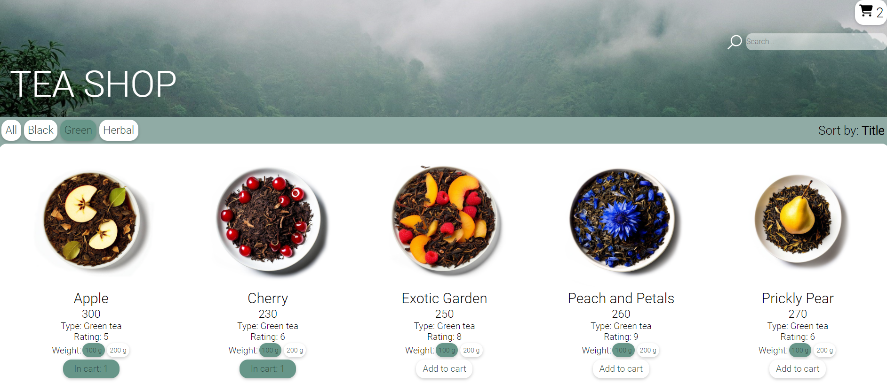

# Tea Shop

<br />
Интернет-магазин чая. Прототип магазина создан как основа для дальнейшего расширения и интеграции с реальными данными.
<br />
Link: https://teaonlinestore.netlify.app/

## Technologies Used

- Typescript
- React
- Redux Toolkit (включая createAsyncThunk для асинхронных запросов)
- SCSS (Sass)
- React Router
- Custom React Hooks
- Static Data Source (JSON)

## Preview



## Features

- Просмотр списка товаров с указанием изображения и информации
- Сортировка результатов выдачи по:
  - Типу чая (чёрный/зелёный/травяной)
  - Названию
  - Цене (по возрастанию и убыванию)
  - Рейтингу (по возрастанию и убыванию)
- Возможность поиска чая
- Пагинация для навигации по результатам выдачи
- Просмотр страницы каждого отдельного чая с описанием
- Возможность добавления чая в корзину со страницы выдачи и со страницы карточки товара (реализовано сохранение в localStorage)
- Возможность выбора веса товара (100г/200г) при добавлении в корзину и расчёт стоимости чая в корзине в зависимости от веса
- Подсчёт стоимости товаров, добавленных в корзину
- Удаление товаров из корзины
- Кастомный хук для получения данных о конкретном чае с помощью его id
- Кастомный хук для добавления чая в корзину
- Для целей демонстрации создан статический JSON-файл, предоставляющий фотографии товаров и информацию о них
- Разработан уникальный пользовательский интерфейс

## Purpose & Outcome

- Для демонстрации функционала было необходимо реализовать взаимодействие с внешним источником данных.

Решение: было разработано собственное API на основе статического JSON-файла для имитации запросов к серверу. Это позволило оптимизировать разработку, сократить время отклика и протестировать функционал в условиях, приближенных к реальным.

- Требовалось реализовать добавление товара в корзину как со страницы выдачи, так и со страницы карточки товара.

Решение: разработан кастомный хук useAddToCart для добавления товара в корзину.

- Требовалось рассчитывать цену товара в корзине в зависимости от выбранного веса.

Решение: создана функция CalculatePrice, которая рассчитывает цену товара в зависимости от выбранного веса.

- Необходимо было обеспечить удобство использования интерфейса на мобильных устройствах и планшетах, а также протестировать отзывчивость макета на разных экранах.

Решение: использование SCSS для создания адаптивной верстки, которая позволила пользователям получить единый опыт на всех устройствах. Пользователи отметили плавный и интуитивно понятный интерфейс на мобильных платформах.

## How to start project

in the project directory enter:

```js
npm install
```

and then

```js
npm run dev
```
